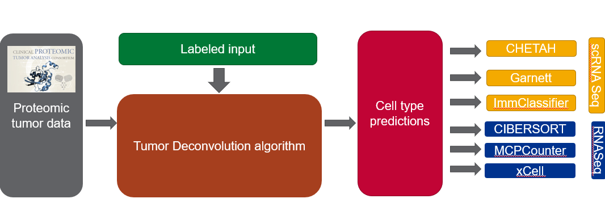

# Decomprolute: Benchmarking study of proteomic based tumor deconvolution
The goal of this package is to provide various metrics to assess the ability of a deconvolution algorithm to identify specific cell types in bulk proteomics data. The package is fully dockerized and can be run with the installation of Docker and a CWL-compliant tool on your local machine.

We employed a modular architecture to enable 'plug and play' comparisons of different datasets and tools.The modules fall into three categories, each with a data collection and analysis module.


## How to use

There are multiple ways to use this package. Given the multiple modules, you can use this package to simply run a deconvolution algorithm a specific dataset, or you can swap out the algorithm for a new one or run on your own data. These various approaches are listed in the [workflows](./workflows/) directory.

### To deconvolve cell types on CPTAC data

The workflow script to run a single algorithm is located in the root of the [workflows](./workflows) directory.

``` shell
cd workflows
cwltool prot-deconv.cwl --cancer hnscc --protAlg mcpcounter --sampleType tumor --signature ../signature_matrices/LM7c.txt
```

This will run the MCP-counter algorithm on proteomics data from the CPTAC breast HNSCC cohort using our LM7c signature.

### To assess _performance_ of existing algorithms
In the absence of a proteomics gold standard, we have implemented three distinct metrics to determine the performance of each algorithm listed below.

#### Performance on simulated data
We have simulated both mRNA and proteomics data from established experiments as described below. We try to evaluate mRNA data on mRNA-derived simulations, and proteomics data on proteomics-derived simulated data. The datasets themselves are stored in the [simulatedData](./simulatedData_) directory.

We have included two `YAML` files to use as test runs of each simulation.

``` shell
cd workflows/data-sim/
cwltool simul-data-comparison.cwl rna-sim-test.yml ##evaluate rna-based deconvolution
cwltool simul-data-comparison.cwl prot-sim-test.yml ##evaluate protein based deconvolution

```

These will produced the necessary summary statistics and figures.

#### mRNA-Proteomics Comparison

We also wanted to measure how _consistent_ an algorithm was between mRNA and proteomics data. This iterates through all algorithms, data, and matrices to and compares how similar each cell type prediction is across mRNA vs. proteomic samples.

``` shell
cd workflows/mrna-prot
cwltool mrna-prot-comparison.cwl alg-test.yml
```

This will run the evaluation in our test `YAML` file. To update the parameters, create your own `YAML` file. The algorithm currently has five parameters:
1. mrna-algorithms: List of algorithms to use to deconvolve mRNA data. One of `epic`, `xcell`, `cibersort`, `mcpcounter`.
2. prot-algorithms: List of algorithms to use to deconvolve protein data. One of `epic`, `xcell`, `cibersort`, `mcpcounter`.
3. cancerTypes: List of cancer types
4. signatures: List of signature matrices, currently found in the [signature matrix](./signature_matrices) directory
5. tissueTypes: list of tissue types: `tumor`, `normal`, or `all`

#### Pan-Immune clustering annotation
Lastly we can cross-reference known immune types with predicted cell types from the various deconvolution algorithms to ascertain how well

### To add your own algorithm or data

To test your own algorithm, or data, we suggest putting it in its own Docker image. For more details please see the [Contributing Guide](./contribution_guide/).


## Data
For this module we have collected real and simulated data.

### CPTAC Data

This algorithm leverages data collected through the clinical proteomic tumor analysis consortium (CPTAC) as the foundation of its benchmarking metrics. This consortium has collected hundreds of patient tumor data, including proteomic and transcriptomic data from the same patients. Given the general confidence in transcriptomic-based tumor convolution, we can use these data to compare transcriptomic and proteomic tumor deconvolution in the same patient samples

We have collect this data via the [CPTAC Python API](https://github.com/PayneLab/cptac) to better match the mRNA data. This CWL tool and Docker image are in the [protData](./protData) and [mRNAdata](./mRNAData) directories.

Below are the available tumor types:

Dataset name | Description | Data reuse status | Publication link
-- | -- | -- | --
Brca | breast cancer | no restrictions | https://pubmed.ncbi.nlm.nih.gov/33212010/
Ccrcc | clear cell renal cell carcinoma (kidney) | no restrictions | https://pubmed.ncbi.nlm.nih.gov/31675502/
Colon | colorectal cancer | no restrictions | https://pubmed.ncbi.nlm.nih.gov/31031003/
Endometrial | endometrial carcinoma (uterine) | no restrictions | https://pubmed.ncbi.nlm.nih.gov/32059776/
Gbm | glioblastoma | no restrictions | https://pubmed.ncbi.nlm.nih.gov/33577785/
Hnscc | head and neck squamous cell carcinoma | no restrictions | https://pubmed.ncbi.nlm.nih.gov/33417831/
**Lscc | lung squamous cell carcinoma | password access only | unpublished**
Luad | lung adenocarcinoma | no restrictions | https://pubmed.ncbi.nlm.nih.gov/32649874/
Ovarian | high grade serous ovarian cancer | no restrictions | https://pubmed.ncbi.nlm.nih.gov/27372738/
**Pdac | pancreatic ductal adenocarcinoma | password access only | unpublished**

As such, datasets have been updated to following (added hnscc):
['brca', 'ccrcc', 'endometrial', 'colon', 'ovarian', 'hnscc', 'luad']


### Simulated data
We also evaluate the algorithms on simulated data.


## Algorithms
We have included numerous algorithms in this package. Docker files and requisite data are included in the [tumorDeconvAlgs](./tumorDeconvAlgs) folder.

| Algorithm                           | Source |
| ---                                 | ---    |
| [cibersort](./tumorDeconvAlgs/cibersort)|       |
| [epic](./tumorDeconvAlgs/epic)|  |
| [xcell](/tumorDeconvAlgs/xcell)| |
| [mcpcounter](./tumorDeconvAlgos/xcell)| |


## Cell type signatures
There are numerous ways to define the individual cell types we are using to run the deconvolution algorithms. We will upload specific lists to compare in our workflow.

| List Name | Description | Source |
| --- | --- | --- |
| LM7c | Seven cell types (B, CD4 T, CD8 T, dendritic cells, granulocytes, monocytes, NK) collapsed from proteomic data | [Rieckmann et al.](https://pubmed.ncbi.nlm.nih.gov/28263321/)|
| 3' PBMCs | Seven cell types (B, CD4 T, CD8 T (CD8 T + NK T), dendritic cells, megakaryocytes, monocytes, NK) from scRNA-seq data | [Newman et al.](https://pubmed.ncbi.nlm.nih.gov/31061481/)|
| LM10 | Ten cell types predicted by MCPCounter signature | |
| LM22 | The original matrix from cibersort  | |
